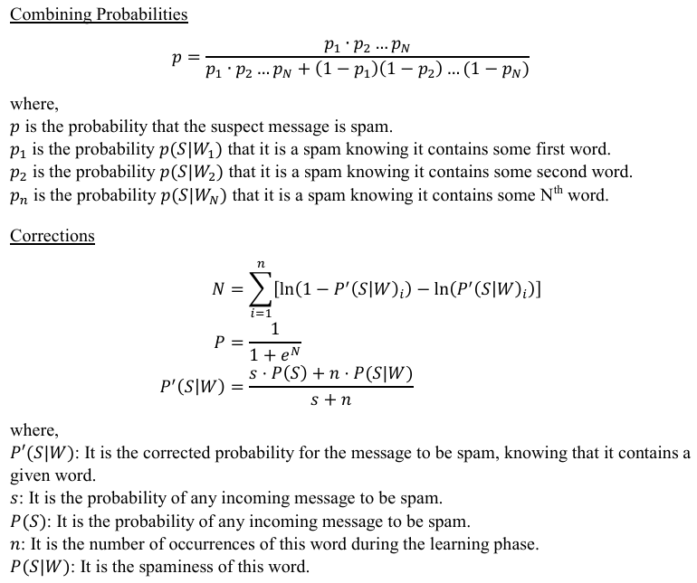

# Spam-detection-using-naive-bayes-classifier
<h1>Spam email classification.</h1>

## Dataset

The `spam.csv` dataset is a well-known dataset often used in machine learning and natural language processing (NLP) tasks, particularly for spam email classification. The dataset is commonly available in various machine learning libraries and repositories and it’s often used as a benchmark dataset in educational materials and tutorials.
 
The dataset typically contains two columns:
<ul>
       <li>Label"</li>
       <li>Text Messages</li>
</ul> 
The dataset is used for training and evaluating machine learning models, particularly for binary classification tasks where the goal is to distinguish between spam and ham messages based on their content. 
 

## Spam Filtering with Naïve Bayes:

Bayes theorem is given by: 
`𝑃(𝐴|𝐵)=(𝑃(𝐵|𝐴)*𝑃(𝐴))/𝑃(𝐵)`
where,
<ul>
       <li> 𝑃(𝐴|𝐵): the likelihood of event 𝐴 occurring given that 𝐵 is true.</li>
       <li>𝑃(𝐵|𝐴): the likelihood of even 𝐵 occurring given that 𝐴 is true.</li> 
       <li>𝑃(𝐴) and 𝑃(𝐵) are the probabilities of observing 𝐴 and 𝐵independently of each other.</li> 
</ul>
 

## Bayes theorem for spam filtering 

`𝑃(𝑆|𝑊) =(𝑃(𝑊|𝑆)*𝑃(𝑆)) / (𝑃(𝑊/𝑆)*𝑃(𝑆)+𝑃(𝑊|𝐻)*𝑃(𝐻))`
 where, 
<ul>
<li>𝑃(𝑆|𝑊): The probability that a message is a spam, knowing that a specific word is in it.</li>

<li>𝑃(𝑊|𝑆): The probability that the specific word appears in spam messages. </li>

<li>𝑃(𝑆): The overall probability that any given message is spam.</li> 

<li>𝑃(𝑊|𝐻): The probability that the specific word appears in ham messages. </li>

<li>𝑃(𝐻): The overall probability that any given message is ham. </li>
</ul>

## Unbiased approach 

`𝑃(𝑆|𝑊) =𝑃(𝑊|𝑆)/(𝑃(𝑊|𝑆) +𝑃(𝑊|𝐻))`

𝑃(𝑊|𝑆) = (𝑠𝑝𝑎𝑚 𝑚𝑒𝑠𝑠𝑎𝑔𝑒𝑠 𝑐𝑜𝑛𝑡𝑎𝑖𝑛𝑖𝑛𝑔 𝑡ℎ𝑒 𝑤𝑜𝑟𝑑)/(𝑎𝑙𝑙 𝑚𝑒𝑠𝑠𝑎𝑔𝑒𝑠 𝑐𝑜𝑛𝑡𝑎𝑖𝑛𝑖𝑛𝑔 𝑡ℎ𝑒 𝑤𝑜𝑟𝑑)
 𝑃(𝑊|𝐻) = (ℎ𝑎𝑚 𝑚𝑒𝑠𝑠𝑎𝑔𝑒𝑠 𝑐𝑜𝑛𝑡𝑎𝑖𝑛𝑖𝑛𝑔 𝑡ℎ𝑒 𝑤𝑜𝑟𝑑)/(𝑎𝑙𝑙 𝑚𝑒𝑠𝑠𝑎𝑔𝑒𝑠 𝑐𝑜𝑛𝑡𝑎𝑖𝑛𝑖𝑛𝑔 𝑡ℎ𝑒 𝑤𝑜𝑟d)

## Combining Probabilities and Corrections

  

## Procedure

- Load the data from spam.csv
- Perform EDA on the data
- Visualization of data using matplotlib function
- Perform text processing methods
- Perform naive bayes classifier to find the spam messages

## About spamGui.py
A Gui interface to get input and predict weather the message is spam or not
 